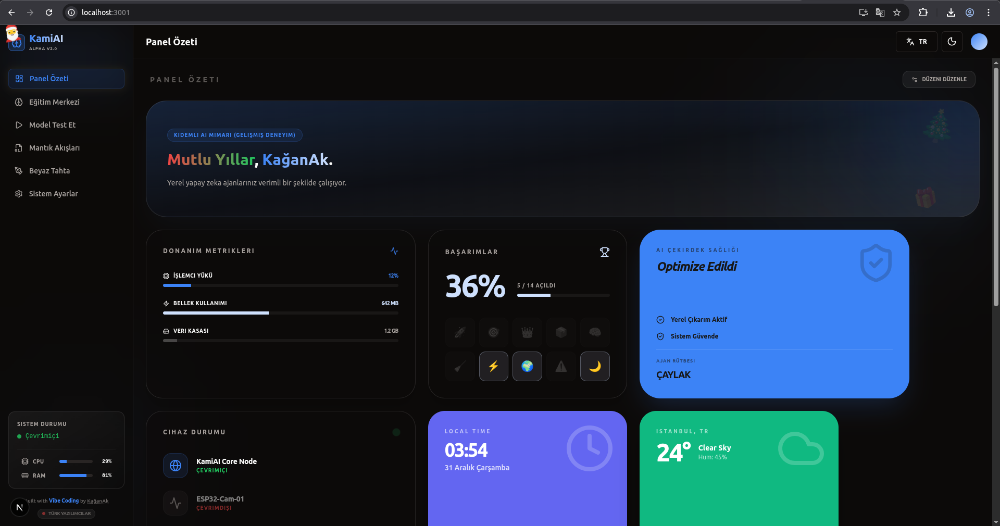

<!-- ===================== -->
<!--      KAMI AI          -->
<!-- ===================== -->
<!-- TYPE-C DESTEKLİ ⚡ Goblinhan Yıkan -->
<!-- TYPE-C SUPPORTED ⚡ Goblinhan Yıkan -->

<a id="readme-top"></a>

<h1 align="center">KamiAI <sup>(BETA)</sup></h1>

<p align="center">
  <b>Next-Gen • Local-First • Extreme Customization AI Studio</b>
</p>

<p align="center">
  <a href="#-türkçe--turkish">🇹🇷 Türkçe</a> •
  <a href="#-english">🇬🇧 English</a>
</p>

<p align="center">
  
  
  
  
</p>

<!--<p align="center">
  
</p> 

-->

## Preview / Önizleme

<p align="center">
  
</p>

---

## 🇹🇷 Türkçe / Turkish

### 🇹🇷 KamiAI Nedir?

**KamiAI**, tamamen **yerel çalışan**, **tarayıcı tabanlı**,  
**gizlilik odaklı** yeni nesil bir **Yapay Zeka eğitim ve otomasyon stüdyosudur**.

Bulut tabanlı sistemlerin aksine:
- ☁️ Cloud yok  
- 🔒 Tracking yok  
- 🧠 Kontrol %100 sende  

---

### 🚀 Özellikler

- 🧠 **Vision Studio**  
  Kameradan gerçek zamanlı nesne tanıma ve yerel model eğitimi

- 🧩 **Drag & Drop Dashboard**  
  Widget tabanlı, tamamen özelleştirilebilir arayüz

- 🔗 **Logic Flows**  
  Node tabanlı otomasyon sistemi (React Flow)

- 🎨 **Extreme UI Customization**  
  RGB temalar, glassmorphism, UI ölçekleme

- 📦 **PWA Desteği**  
  Offline çalışma & native uygulama hissi

---

### 🧠 Teknoloji Stack

<p align="center">
  
</p>

---

### ⚙️ Kurulum

```bash
git clone https://github.com/KaganAk71/KamiAI.git
cd KamiAI
npm install
npm run dev
````

Tarayıcıdan aç:

```
http://localhost:3000
```

---

### 🧪 Kullanım

1️⃣ Dashboard’u widget’larla özelleştir
2️⃣ Vision Studio → class ekle
3️⃣ Train’e bas → kameradan veri topla
4️⃣ Model anında tahmin yapsın
5️⃣ Logic Flow ile otomasyon kur 🔥

---

## 🇬🇧 English

### 🇬🇧 What is KamiAI?

**KamiAI** is a **local-first**, browser-based AI training and automation studio
built with **privacy, performance, and extreme customization** in mind.

Unlike cloud-based solutions:

* ☁️ No cloud
* 🔒 No tracking
* 🧠 Full user control

---

### 🚀 Features

* 🧠 **Vision Studio**
  Real-time object detection & local model training via webcam

* 🧩 **Drag & Drop Dashboard**
  Fully customizable widget-based interface

* 🔗 **Logic Flows**
  Node-based automation pipelines (React Flow)

* 🎨 **Extreme UI Customization**
  RGB themes, glassmorphism effects, UI scaling

* 📦 **PWA Support**
  Offline usage & native-like installation

---

### ⚙️ Installation

```bash
git clone https://github.com/KaganAk71/KamiAI.git
cd KamiAI
npm install
npm run dev
```

Open in browser:

```
http://localhost:3000
```

---

## 🗺 Roadmap

* [x] Core Architecture
* [x] Vision Module (TF.js)
* [x] Theme Engine (RGB)
* [x] PWA Support
* [ ] Hardware Metrics (CPU / RAM)
* [ ] Advanced Logic Flow Editor
* [x] Turkish
* [x] English

---

## 🤝 Contributing / Katkı

Pull request, issue ve fikirler memnuniyetle karşılanır 🚀
Contributions, issues, and feature requests are welcome!

---

## 🧑‍💻 Developer

**KağanAk**
🔗 [https://github.com/KaganAk71](https://github.com/KaganAk71)

---

## ☕ Support / Destek

<p align="center">
  <b>Biz Türk Yazılımcılarıyız 🇹🇷💻</b><br/>
  We are Turkish Coders 🇹🇷💻
</p>

<p align="center">
  Deneyap Atölyelerinde kurulduk ve şimdi burada projelerimizi geliştiriyoruz.<br/>
  Sizlerin desteğiyle daha da iyisini yapacağız.
</p>

<p align="center">
  We were founded in the Deneyap Workshops, and we are now developing our projects here.<br/>
  With your support, we will become even better.
</p>

<!-- <p align="center">
  Daha fazla proje ve bağımsız geliştirme için /  
  To support more projects:
</p>

<p align="center">
  ☕ <b>Buy Me a Coffee</b><br/>
  👉 <i></i>
</p>

---
-->
<p align="center">
  <b>🔥 Made with passion by Turkish Coders</b><br/>
  <i>Your Code. Your Freedom.</i>
</p>

<p align="right">(<a href="#readme-top">back to top</a>)</p>
